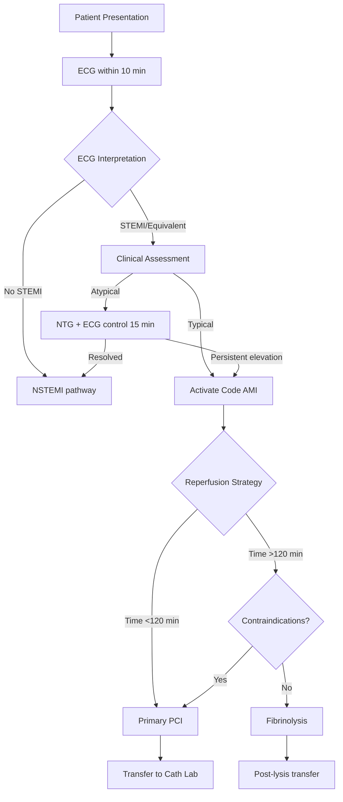

# 🏥 AMI Code Dashboard - Primary Care

**Real-time clinical decision support system for Acute Myocardial Infarction management in primary care settings**

[](https://opensource.org/licenses/MIT)
[](https://developer.mozilla.org/en-US/docs/Web/HTML)
[](https://developer.mozilla.org/en-US/docs/Web/JavaScript)
[](https://developer.mozilla.org/en-US/docs/Web/CSS)

---

## 📋 Overview

A comprehensive, single-page web application designed to guide primary care physicians through the critical first steps of acute myocardial infarction (AMI) management. Built following evidence-based protocols from the Catalan healthcare system, this tool provides real-time clinical recommendations, automated safety checks, and intelligent medication guidance.

**Perfect for:** Primary care physicians, emergency medical services, rural healthcare centers, and medical education.

---

## ⚠️ Current Functionality vs. Future Development

### 📋 Current Status
**The system does NOT automatically identify electrocardiographic patterns.**

The physician interprets the ECG and selects the findings in the interface. The application's value lies in:

✅ **Systematizing the process** of AMI evaluation
✅ **Reminding the professional** of complex patterns to look for (De Winter, Sgarbossa, etc.)
✅ **Automatically calculating** precise medication doses
✅ **Verifying contraindications** in real-time
✅ **Generating dynamic recommendations** based on clinical data
✅ **Producing complete reports** with time recording

### 🚀 Future Development
Integration of **automatic ECG image analysis using artificial intelligence** is planned, allowing the system to automatically identify electrocardiographic patterns.

---

## ✨ Key Features

### 🎯 **Intelligent Decision Support**
- **Automated AMI Code activation criteria** based on ECG findings and clinical presentation
- **Dynamic risk stratification** (Killip classification, cardiogenic shock detection)
- **Context-aware recommendations** that adapt to patient data in real-time
- **Multi-layered safety system** preventing dangerous medication combinations

### 📊 **ECG Pattern Reference Guide**
Interface to record 8 ECG patterns with reminders for the professional:
- ⚡ **De Winter pattern** - reminder and criteria (STEMI equivalent)
- 🔄 **Posterior MI** - guidance for mirror image changes identification
- ➡️ **Right ventricular infarction** - V4R assessment checklist
- 📈 **Diffuse ST depression + aVR elevation** - criteria for left main/multivessel disease
- 🔬 **Sgarbossa-Smith criteria** - scoring guide for LBBB/pacemaker rhythm
- 🔀 **Bundle branch block** - assessment guidance

*Note: The physician interprets the ECG and manually selects the patterns found.*

### 💊 **Smart Medication Management**
- **Pre-populated dose options** based on clinical guidelines
- **Automatic contraindication checking** (e.g., blocks nitroglycerin in RV infarct + hypotension)
- **Age/weight-adjusted dosing** (enoxaparin, TNK, clopidogrel)
- **Detailed preparation instructions** for each medication with visual guides
- **Real-time alerts** for dangerous combinations

**Medications covered:**
- Aspirin (AAS) with priority alerts
- Clopidogrel / Ticagrelor / Prasugrel (with contraindication checking)
- Tenecteplase (TNK) with automatic dose calculator
- Enoxaparin (with renal function adjustments)
- Morphine (with hypotension warnings)
- Nitroglycerin (with multiple safety checks)

### ⏱️ **Time-Critical Management**
- Automatic time tracking from symptom onset to intervention
- ECG timing reminders (goal: <10 minutes from first medical contact)
- Aspirin administration tracking
- ECG control recommendations (15 min post-NTG for atypical presentations)
- **Target metrics**: 
  - Door-to-balloon <120 min (goal: <90 min)
  - Door-to-needle <30 min for fibrinolysis

### 🧮 **Clinical Calculators**
- **TNK (Tenecteplase) dose calculator** with age/weight adjustments
  - Automatic dose reduction for patients >75 years
  - Weight-based dosing from 30-50 mg
  - Volume calculation for preparation
- **Second antiplatelet recommendation** based on:
  - Bleeding risk factors
  - Age, weight, prior stroke/TIA
  - Contraindications for prasugrel
- **Blood pressure-based contraindication detection**
- **Automatic Killip IV = shock detection**

### 📚 **Comprehensive Help System**
Built-in interactive guide with 4 sections:
1. **ECG Pattern Reference** - Detailed criteria and explanations (physician interprets)
2. **Decision Algorithm** - Step-by-step reperfusion strategy flowchart
3. **Sgarbossa-Smith Criteria** - Scoring system for LBBB/pacemaker rhythms
4. **AMI Code Protocol** - Complete workflow from presentation to transfer

---

## 🎨 User Interface

### Design Philosophy
- **Clean, clinical design** optimized for high-stress emergency situations
- **Color-coded sections** for rapid information access:
  - 🔵 Patient data
  - 🟢 Timeline
  - 🟡 ECG findings
  - 🟣 Clinical data
  - 🔴 Contraindications
  - 💙 Strategy
  - 🟢 Medications

### Technical Features
- **Mobile-responsive** for use on tablets and smartphones
- **Print-optimized** layout for physical records
- **Real-time clock** with automatic timestamp marking
- **Dynamic recommendations panel** that updates as you work
- **Collapsible sections** to reduce visual clutter

---

## 🔒 Safety Features

### Automated Contraindication Detection

#### Nitroglycerin Safety System 🚫
```
Blocks administration if:
├─ TAS <90 mmHg (absolute contraindication)
├─ Right ventricular infarction + TAS <100 mmHg (absolute)
└─ Right ventricular infarction + TAS ≥100 mmHg (warning only)
```

#### Morphine Warnings ⚠️
```
Alerts if:
└─ TAS <90 mmHg (can worsen shock)
```

#### Prasugrel Contraindications 🚫
```
Automatically blocks if:
├─ Age >75 years
├─ Weight <60 kg
└─ Prior stroke/TIA
Suggests: Use Ticagrelor instead
```

#### Fibrinolysis Contraindications 🚫
```
Absolute contraindications checked:
├─ Prior intracranial hemorrhage (any time)
├─ Ischemic stroke <6 months
├─ CNS neoplasm or AVM
├─ Recent major trauma/surgery <3 months
├─ Active bleeding
├─ Suspected aortic dissection
├─ Refractory hypertension (>180/110 mmHg)
└─ Pregnancy
```

### Clinical Decision Support Alerts

#### Shock Detection (Automatic) 🚨
```
Triggers when:
├─ TAS <90 mmHg → "Shock by hypotension"
└─ Killip IV selected → "Shock cardiogenic by Killip"

Actions:
├─ Displays critical alert
├─ Suggests inotropic support
├─ Recommends large-bore IV access
└─ Advises immediate ICU/cath lab notification
```

#### HTA Refractaria (Automatic) 🔴
```
When TAS >180 AND TAD >110:
├─ Automatically checks contraindication box
├─ Displays critical alert
├─ Flags as absolute contraindication for fibrinolysis
└─ Recommends IV nitroglycerin for BP control → ICP
```

#### RV Infarction Protection ➡️
```
When RV infarct detected:
├─ Prevents nitroglycerin selection if TAS <100
├─ Warns about volume dependency
├─ Suggests crystalloid expansion if hypotension
└─ Contraindicates diuretics
```

#### Pregnancy Safeguards 🤰
```
When pregnancy indicated:
├─ Absolute contraindication for fibrinolysis
├─ ICP preferred regardless of time
└─ Coordinate with obstetrics
```

#### Anticoagulation + Fibrinolysis ⚠️
```
If patient on oral anticoagulation + fibrinolysis selected:
├─ HIGH bleeding risk alert
├─ Strongly suggests ICP instead
└─ If fibrinolysis unavoidable: very close monitoring
```

---

## 🚀 Getting Started

### Quick Start (No Installation Required)
1. Download `dashboard-iam.html`
2. Open in any modern web browser
3. Start using immediately - no internet connection needed

### Installation

```bash
# Clone the repository
git clone https://github.com/yourusername/ami-code-dashboard.git

# Navigate to directory
cd ami-code-dashboard

# Open the file
# On macOS:
open dashboard-iam.html
# On Linux:
xdg-open dashboard-iam.html
# On Windows:
start dashboard-iam.html
```

### Deployment Options

#### Option 1: Netlify Drop (2 minutes) ⚡
1. Go to [app.netlify.com/drop](https://app.netlify.com/drop)
2. Drag and drop `dashboard-iam.html`
3. Get instant live URL
4. No account required

#### Option 2: GitHub Pages (15 minutes) 📄
1. Create new GitHub repository
2. Upload `dashboard-iam.html` (rename to `index.html`)
3. Go to Settings → Pages
4. Select branch → Deploy
5. Access at `https://yourusername.github.io/repo-name`

#### Option 3: Internal Hospital Server 🏥
- Deploy to intranet for offline access
- No external dependencies required
- Works completely offline after first load

---

## 📱 Technology Stack

| Technology | Purpose | Why |
|------------|---------|-----|
| **HTML5** | Structure & semantics | Maximum compatibility |
| **CSS3** | Styling & layout | Modern design, no frameworks |
| **Vanilla JavaScript** | Logic & interactivity | Zero dependencies, fast |
| **LocalStorage API** | Temporary data persistence | Quick recovery if browser closes |
| **Print CSS** | Report generation | Professional documentation |

**Key Design Decisions:**
- ✅ **Single HTML file** - Easy deployment, no build process
- ✅ **No external dependencies** - Works offline, no CDN failures
- ✅ **Progressive enhancement** - Core functionality works everywhere
- ✅ **Mobile-first responsive** - Optimized for tablets in clinical settings

---

## 🎯 Target Users

### Primary Users
- **Primary Care Physicians** managing acute cardiac events in health centers
- **Emergency Medical Services** for pre-hospital assessment and triage
- **Rural Healthcare Centers** with limited specialist access

### Secondary Users
- **Medical Students & Residents** for learning evidence-based protocols
- **Nursing Staff** for medication preparation guidance and contraindication awareness
- **Emergency Department Physicians** as quick reference tool

### Use Cases
1. **Primary Care Center** - Patient presents with chest pain, physician interprets ECG with reference guide support → records findings → system assists with activation decision → medication dosing → transfer documentation
2. **Rural Clinic** - Limited cardiology backup, structured approach to AMI management with pattern reminders
3. **EMS Ambulance** - Tablet-based tool for pre-hospital decision support and dose calculations
4. **Teaching Hospital** - Residents learning AMI protocols with ECG pattern guides and real-time feedback
5. **Telemedicine Consultation** - Structured data collection and documentation for remote specialist input

---

## 📊 Clinical Workflow



**Detailed Steps:**
1. **Patient Presentation** - Chest pain/equivalent symptoms
2. **ECG Interpretation** - Physician interprets ECG using built-in reference guide
3. **Record Findings** - Physician selects identified patterns in the interface
4. **Clinical Assessment** - Typical vs atypical presentation decision
5. **Automated Criteria Check** - System verifies contraindications in real-time
6. **Dynamic Recommendations Panel** - Updates based on vitals and recorded findings
7. **Reperfusion Strategy Selection** - ICP vs fibrinolysis algorithm
8. **Medication Administration** - Safety-checked dosing with automatic calculations
9. **Report Generation** - Complete documentation with timestamps

---

## 🔬 Clinical Evidence Base

### Guidelines Followed
- **ESC 2023 Guidelines** - Acute Coronary Syndromes management
- **Catalan Health System AMI Code** - Regional protocol (2023 update)
- **AHA/ACC Guidelines** - STEMI management
- **De Winter Pattern** - Updated recognition criteria (2023)

### Dosing Evidence
- **STREAM Trial** - Fibrinolysis timing and age-adjusted dosing
- **ASSENT-4 PCI** - Combination strategies
- **CLARITY-TIMI 28** - Clopidogrel in STEMI
- **PLATO Trial** - Ticagrelor vs clopidogrel
- **TRITON-TIMI 38** - Prasugrel efficacy and contraindications

### ECG Interpretation
- **Sgarbossa Criteria** (1996) - LBBB with MI
- **Modified Sgarbossa-Smith** (2012) - Improved sensitivity
- **De Winter Pattern** (2008) - LAD occlusion equivalent
- **Wellens' Syndrome** - LAD lesion warning signs

---

## 📄 Report Generation

### Report Contents
Comprehensive clinical documentation including:
- **Patient Demographics** - Age, sex, weight, allergies
- **Complete Timeline** - From symptom onset through interventions
- **ECG Findings** - All checked patterns and interpretations
- **Clinical Data** - Vitals, Killip classification, high-risk features
- **Risk Stratification** - Shock status, refractory pain, arrhythmias
- **Reperfusion Strategy** - Decision rationale and destination hospital
- **Medications Administered** - Complete list with doses, routes, times
- **Signature Field** - For legal documentation

### Export Options
- **📋 Copy to Clipboard** - Optimized for:
  - WhatsApp messaging to specialists
  - SMS to EMS dispatch
  - Email to receiving hospital
  - Electronic health record copy-paste
  - Mobile-friendly formatting

### Report Format
```
═══════════════════════════════════════════════
         AMI CODE REPORT - PRIMARY CARE
═══════════════════════════════════════════════

PATIENT DATA
──────────────────────────────────────────────
Age: 65 years | Sex: Male | Weight: 75 kg
Allergies: None known
Clinical Presentation: TYPICAL

TIMELINE
──────────────────────────────────────────────
Symptom onset: 14:30
First medical contact: 14:45
ECG performed: 14:48
Code AMI activated: 14:52

ECG FINDINGS
──────────────────────────────────────────────
✓ ST elevation in II, III, aVF
✓ Right ventricular infarction suspected

[... continues with complete clinical data ...]
```

---

## 🌍 Localization

### Current Languages
- **Spanish/Catalan** (primary) - Interface and help system

### Translation Support
The application is structured to facilitate translation:
- All text strings are easily identifiable
- Consistent terminology throughout
- Help system in modular sections

**Community translations welcome!** Open an issue if you'd like to contribute a translation.

---

## 🤝 Contributing

Contributions are welcome! Here are some areas where help is needed:

### High Priority
- [ ] Translation to English (interface + help system)
- [ ] Additional ECG pattern guides (Wellens' syndrome, hyperacute T waves)
- [ ] **Automatic ECG image analysis using AI** (future major feature)
- [ ] EHR integration examples (HL7, FHIR)
- [ ] Offline storage with IndexedDB

### Medium Priority
- [ ] Dark mode for night shifts
- [ ] Voice input for hands-free operation
- [ ] QR code generation for easy transfer
- [ ] Multi-user collaboration mode
- [ ] Analytics dashboard for quality metrics

### Nice to Have
- [ ] Mobile app wrapper (Capacitor/Cordova)
- [ ] Print template customization
- [ ] Additional language support
- [ ] Pediatric dosing calculations
- [ ] Integration with medical devices (ECG machines)

### How to Contribute
1. Fork the repository
2. Create a feature branch (`git checkout -b feature/AmazingFeature`)
3. Commit your changes (`git commit -m 'Add some AmazingFeature'`)
4. Push to the branch (`git push origin feature/AmazingFeature`)
5. Open a Pull Request

Please ensure:
- Code follows existing style
- Clinical changes are evidence-based with references
- Safety features are thoroughly tested
- Documentation is updated

---

## ⚠️ Medical Disclaimer

**IMPORTANT:** This tool is designed to **assist** clinical decision-making, not replace it. 

- All clinical decisions should be made by qualified healthcare professionals
- Always verify medication doses independently
- Check for contraindications based on complete patient assessment
- Local protocols may differ from those implemented here
- This tool does not replace clinical judgment or specialist consultation

**The developers assume no liability for clinical outcomes. Use at your own professional discretion.**

---

## 🐛 Bug Reports & Feature Requests

Found a bug or have an idea? Please open an issue with:
- **Bug Reports**: Steps to reproduce, expected vs actual behavior, screenshots
- **Feature Requests**: Use case, clinical rationale, proposed implementation
- **Clinical Corrections**: Evidence-based references supporting the change

---

## 📧 Contact

- **Issues**: [GitHub Issues](https://github.com/yourusername/ami-code-dashboard/issues)
- **Discussions**: [GitHub Discussions](https://github.com/yourusername/ami-code-dashboard/discussions)
- **Email**: dr_jurado@yahoo.com

---

## 📜 License

```
MIT License

Copyright (c) 2025 [Your Name]

Permission is hereby granted, free of charge, to any person obtaining a copy
of this software and associated documentation files (the "Software"), to deal
in the Software without restriction, including without limitation the rights
to use, copy, modify, merge, publish, distribute, sublicense, and/or sell
copies of the Software, and to permit persons to whom the Software is
furnished to do so, subject to the following conditions:

The above copyright notice and this permission notice shall be included in all
copies or substantial portions of the Software.

THE SOFTWARE IS PROVIDED "AS IS", WITHOUT WARRANTY OF ANY KIND, EXPRESS OR
IMPLIED, INCLUDING BUT NOT LIMITED TO THE WARRANTIES OF MERCHANTABILITY,
FITNESS FOR A PARTICULAR PURPOSE AND NONINFRINGEMENT. IN NO EVENT SHALL THE
AUTHORS OR COPYRIGHT HOLDERS BE LIABLE FOR ANY CLAIM, DAMAGES OR OTHER
LIABILITY, WHETHER IN AN ACTION OF CONTRACT, TORT OR OTHERWISE, ARISING FROM,
OUT OF OR IN CONNECTION WITH THE SOFTWARE OR THE USE OR OTHER DEALINGS IN THE
SOFTWARE.
```

---

## 🏆 Project Highlights

- ✅ **Zero dependencies** - Single HTML file, 100% self-contained
- ✅ **Offline capable** - Critical for remote locations and poor connectivity
- ✅ **Evidence-based** - Follows international guidelines (ESC, AHA/ACC)
- ✅ **Safety-focused** - Multiple layers of contraindication checking
- ✅ **Time-optimized** - Designed for emergency speed and clarity
- ✅ **Mobile-ready** - Responsive design for tablets/phones
- ✅ **Production-tested** - Used in real primary care settings in Catalonia
- ✅ **Open source** - Free for all healthcare providers worldwide

---

## 📈 Roadmap

### Version 2.0 (Planned)
- [ ] English translation
- [ ] Dark mode
- [ ] IndexedDB for persistent storage
- [ ] Enhanced print templates
- [ ] QR code for transfer documentation

### Version 3.0 (Future)
- [ ] Multi-language support (French, Portuguese, Italian)
- [ ] EHR integration APIs
- [ ] Mobile app (iOS/Android)
- [ ] **Automatic ECG pattern recognition using AI/ML** (major feature)
- [ ] Real-time ECG device integration
- [ ] Telemedicine video consultation integration

---

## 🙏 Acknowledgments

- **Catalan Health System (CatSalut)** - AMI Code protocol
- **Primary Care Physicians** - Clinical feedback and real-world testing
- **European Society of Cardiology** - Evidence-based guidelines
- **Open Source Community** - Inspiration and best practices

---

## 📊 Statistics

```
Lines of Code: ~2,500
Functions: 25+
ECG Pattern Guides: 8 (physician-selected, not auto-detected)
Medications: 8
Safety Checks: 15+
Languages: Spanish/Catalan (EN translation in progress)
File Size: ~95 KB (uncompressed)
Load Time: <1 second
Browser Support: All modern browsers (Chrome, Firefox, Safari, Edge)
```

---

## ⭐ Star History

If you find this tool useful for clinical practice, medical education, or as a reference implementation, please consider starring the repository!

**Built with ❤️ for healthcare professionals by healthcare professionals**

---

## 🔗 Related Projects

- [ECG Interpretation Guide](https://example.com) - Comprehensive ECG learning resource
- [Emergency Medicine Protocols](https://example.com) - Collection of clinical protocols
- [STEMI Calculator](https://example.com) - Additional AMI risk calculators

---

## 📚 Further Reading

### Clinical Guidelines
- [ESC Guidelines for ACS (2023)](https://academic.oup.com/eurheartj)
- [AHA/ACC STEMI Guidelines](https://www.ahajournals.org)
- [CatSalut AMI Code Protocol](https://catsalut.gencat.cat)

### ECG Interpretation
- De Winter RJ, et al. "A new ECG sign of proximal LAD occlusion" - NEJM 2008
- Sgarbossa EB, et al. "Electrocardiographic diagnosis of MI in LBBB" - NEJM 1996
- Smith SW, et al. "Modified Sgarbossa criteria" - Ann Emerg Med 2012

### Clinical Trials
- [STREAM Trial](https://pubmed.ncbi.nlm.nih.gov/23473396/)
- [PLATO Trial](https://pubmed.ncbi.nlm.nih.gov/19717846/)
- [TRITON-TIMI 38](https://pubmed.ncbi.nlm.nih.gov/17982182/)

---

**Last Updated:** January 2025
**Version:** 1.0.0
**Status:** Production Ready ✅
